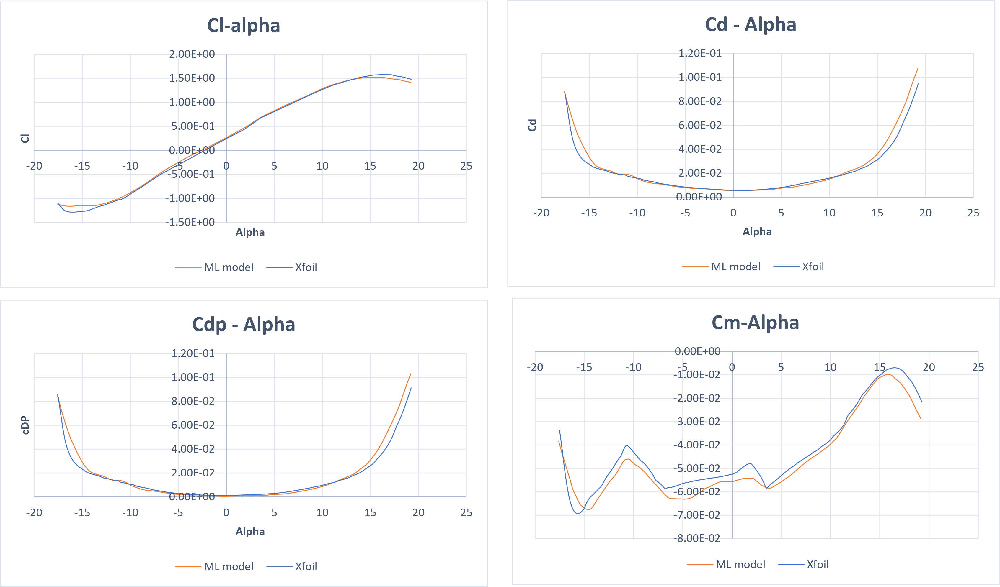

# airfoil-ml
A machine learning surrogate model trained on XFOIL-generated aerodynamic data to predict lift, drag, moment coefficients, and surface pressure distributions for airfoil geometries.

## The Data preprocessing: 

- Reduced raw dataset from 1.5 GB to 500 MB by filtering and cleaning JSON files considering relevance and efficiency
- Performed analysis on data using min-max, deviation, skewness, correlation, ... 
- Choosing the scaling method based on this informayion
- Applied group shuffling to guard against data leakage and improve generalization
- perform scaling, splitting and saving the scalers and index of splits 

The original dataset was restructured for this task, the dataset prepration can be found in data_preprocessing.

Unprocessed dataset can be found at https://nasa-public-data.s3.amazonaws.com/plot3d_utilities/airfoil-learning-dataset.zip This dataset is not normalized and contains the geometry of each airfoil and the xfoil results(originally referenced in the [airfoil-learning](https://github.com/nasa/airfoil-learning)).

## Model Development and Validation:
- Train a MLP on data (perform k-fold validation and optimizing metrics (MSE, R², training time): done in previous version )
- Achieved good performance on validation split and also on truly unseen airfoil configurations (different geometry input is interpolated to match the model feature)

## Results and Visualization
- Plots comparing XFOIL vs ML predictions on identical test cases, demonstrating strong predictive agreement:

- Reducing time comparing to Xfoil with preserved accuracy on unseen geometries, confirming model generalizability.

- Thr accuracy of model prediction for unseen airfoil and conditions:

## Ongoing Work
- Currently refactoring prediction head for pressure-only output to enable fine-tuning or correction models with high resolution Dataset from [link].
- For this purpose : new repo [airfoil-ml-cm](https://github.com/faaarv/airfoil-ml-cm)
